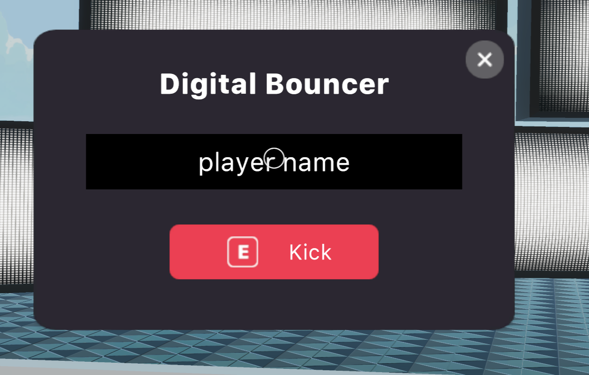
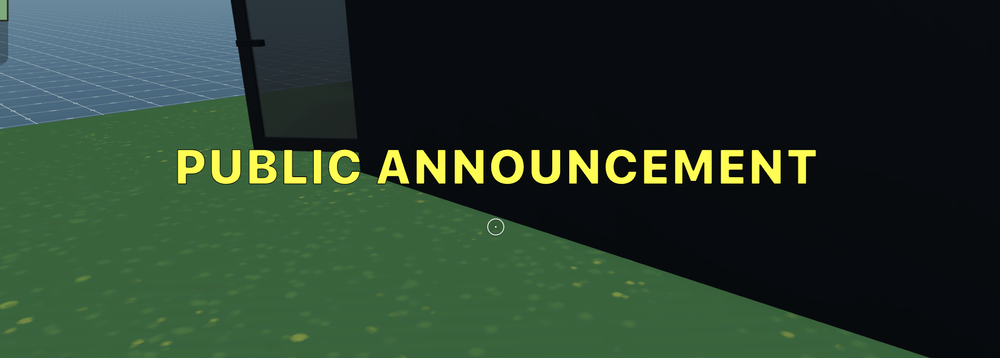

## Digital Bouncer

A simple scene where special admin users can be given special abilities in a scene. This scene shows you:

- How to grant special abilities to admin users in a scene
- How to use a fill-in prompt from the UI library
- How to use the UI library to display announcements
- How to teleport a player to specific coordinates in the scene
- How to toggle the showing and hiding of UIs with global buttons
- How to check if the scene runs in preview or in production

This kind of interface is especially useful in events, where you might want to grant an admin user special abilities to make sure everything runs smoothly, and deter trolls.

Note that all of the actions carried out by a scene admin user are contained in the realm where the user is at. For event that span multiple realms, you should have an admin on each realm, or at least focus on the ones where your scene is the most crowded.



**Install the CLI**

Download and install the Decentraland CLI by running the following command

```bash
npm i -g decentraland
```

For a more details, follow the steps in the [Installation guide](https://docs.decentraland.org/documentation/installation-guide/).

**Previewing the scene**

Once you've installed the CLI, download this example and navigate to its directory from your terminal or command prompt.

_from the scene directory:_

```
$:  dcl start
```

Any dependencies are installed and then the CLI will open the scene in a new browser tab automatically.

**Usage**

If the scene runs in preview, all users behave as admin users. In production, the only ones with admin powers will be those who's names are in the list `allowListedIds` in `bouncerUI.ts`.

An admin usr can do two things

- Click E to toggle the announcement UI. Any messages written here are are displayed for a few seconds on the screens of all players in the scene.



- Click F to toggle the bouncer UI. By writing the display name of a player and pressing "Kick", that player is teleported to the _0,0,0_ corner of the scene, outside the main building.

Learn more about how to build your own scenes in our [documentation](https://docs.decentraland.org/) site.

## Copyright info

This scene is protected with a standard Apache 2 licence. See the terms and conditions in the [LICENSE](/LICENSE) file.
